# Active Directory Attack and Defense — A Technical Reference

**Author:** [TheCyberDefenseGuy](https://github.com/TheCyberDefenseGuy)
**Tags:** `Active Directory` `Red Team` `Blue Team` `MITRE ATT&CK` `T1134` `Windows Security` `Kerberos` `NTLM`
**Level:** Intermediate → Advanced
**Updated:** 2026

---

## Table of Contents

1. [The Anatomy of a Domain](#1-the-anatomy-of-a-domain)
2. [Logon Sessions — The Foundation](#2-logon-sessions--the-foundation)
3. [Access Tokens Deep Dive](#3-access-tokens-deep-dive)
4. [Primary vs. Impersonation Tokens](#4-primary-vs-impersonation-tokens)
5. [Access Checks & UAC](#5-access-checks--uac)
6. [Authentication Protocols: NTLM & Kerberos](#6-authentication-protocols-ntlm--kerberos)
7. [Access Token Manipulation — T1134](#7-access-token-manipulation--t1134)
8. [Credential Access & Dumping](#8-credential-access--dumping)
9. [Lateral Movement](#9-lateral-movement)
10. [Persistence Mechanisms](#10-persistence-mechanisms)
11. [Silver SAML & Entra ID Attacks](#11-silver-saml--entra-id-attacks)
12. [Detection Engineering & Log Analysis](#12-detection-engineering--log-analysis)
13. [Defense-in-Depth Blueprint](#13-defense-in-depth-blueprint)
14. [References](#14-references)

---

## 1. The Anatomy of a Domain

Active Directory is a hierarchical directory service built on LDAP and Kerberos, managing identities, trust, and access across an organization. Before attacking or defending, you need to understand the landscape.

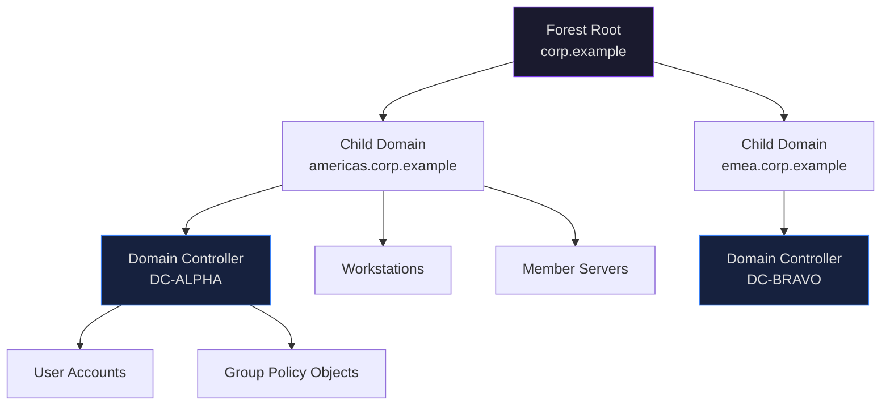

### Key AD Objects — Attack & Defense Matrix

| Object | Purpose | Attacker Goal | Defender Priority |
|--------|---------|--------------|-------------------|
| **Domain Controller** | Hosts NTDS.dit, handles auth | Primary target — full domain access | Tier 0 protection, PAW access only |
| **KRBTGT Account** | Signs all Kerberos tickets | Obtain hash → Golden Ticket | Rotate password regularly (×2) |
| **GPO** | Enforces configuration domain-wide | Persistence, mass malware deployment | Audit GPO permissions and links |
| **Service Accounts** | Run services with delegated rights | Kerberoasting target | Use gMSAs, enforce least privilege |
| **Trust Relationships** | Connect domains/forests | Cross-domain pivot | Restrict SID filtering |
| **AdminSDHolder** | Protects privileged group ACLs | ACL backdoor via SDProp | Monitor ACL changes hourly |
| **ADCS Templates** | Issue certificates | ESC1-8 attack paths | Audit template permissions |

---

## 2. Logon Sessions — The Foundation

Before access tokens exist, logon sessions must be created. This is the base of the entire Windows identity model — and the base attackers must understand to exploit it.

> **Key insight:** A logon session is created when a user successfully authenticates on a system. Every access token is linked back to a logon session via a unique **Logon ID (LUID)**. This relationship is what attackers exploit when performing token manipulation.

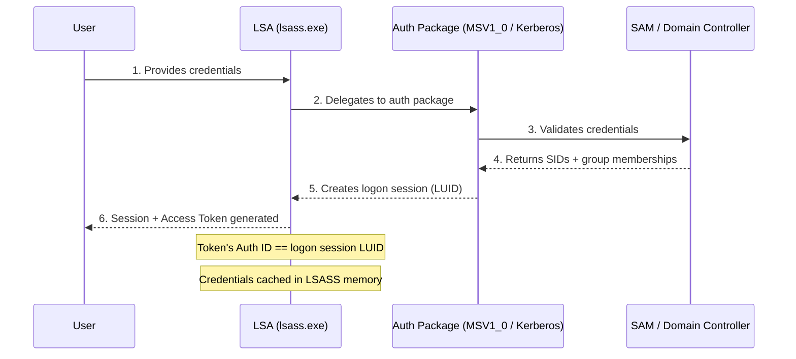

### Logon Types — Event 4624

| Type Code | Name | Created By | Attack Relevance |
|-----------|------|-----------|-----------------|
| 2 | Interactive | Physical/console logon | Standard user login |
| 3 | Network | SMB, mapped drives | Pass-the-Hash, lateral movement |
| 4 | Batch | Scheduled tasks | Persistence |
| 5 | Service | Service startup | Token theft from services |
| 9 | NewCredentials | `runas /netonly` | **Token manipulation key indicator** |
| 10 | RemoteInteractive | RDP | Lateral movement via RDP |

> **UAC Admin Approval Mode:** When an admin logs on interactively, Windows creates **two linked tokens** — a standard filtered token (medium integrity, used by Explorer) and a full admin token (high integrity, used only on elevation). The filtered token has admin group SIDs set to `UseForDenyOnly` and high privileges stripped. Attackers who elevate reclaim the full admin token.

---

## 3. Access Tokens Deep Dive

An **access token** is the security object used by Windows' Security Reference Monitor (SRM) to describe the security context of a process or thread. Every process has one — and attackers who can manipulate it can impersonate any user on the system without knowing their password.

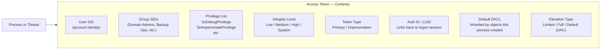

### Fields Attackers Care About Most

| Field | Why Attackers Target It |
|-------|------------------------|
| **Group SIDs** | Domain Admins SID = full domain. Administrators SID = local admin. |
| **SeImpersonatePrivilege** | Allows stealing other tokens — primary path for "Potato" exploits |
| **SeDebugPrivilege** | Allows opening any process → LSASS dump → all credentials |
| **Integrity Level** | Must be High/System to write to privileged locations or inject |
| **Token Type** | Impersonation token required for thread-level impersonation |
| **Auth ID / LUID** | Identifies which logon session holds the credentials in LSASS |
| **Elevation Type** | "Limited" = filtered UAC token. "Full" = elevated. |

### Relevant API Calls (Read/Inspect)

| API | Purpose |
|-----|---------|
| `OpenProcessToken` | Get handle to a process's primary token |
| `OpenThreadToken` | Get handle to a thread's impersonation token |
| `GetTokenInformation` | Read any token field |
| `SetTokenInformation` | Modify token fields |

---

## 4. Primary vs. Impersonation Tokens

This distinction is the mechanical heart of how token-based attacks work.

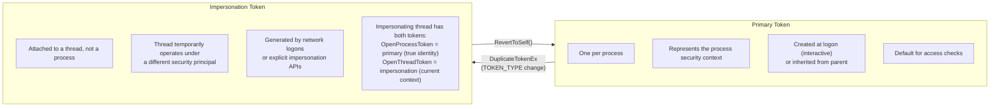

### Impersonation Levels — The Escalation Ladder

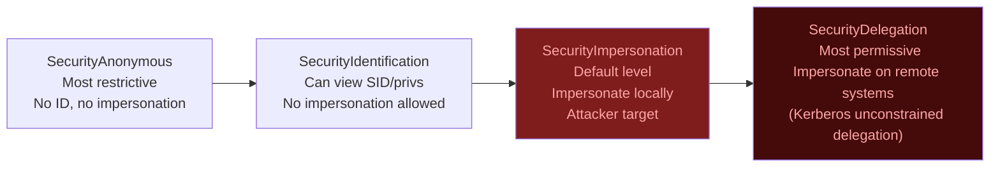

### Key Caveats

- `CreateProcess` — child processes **always inherit the primary token**, never the impersonation token
- Cannot impersonate a **higher integrity level** than currently held
- Threads must call `RevertToSelf()` to drop back to primary context — failure to do so is an indicator of attack
- **Network logons** (Type 3) generate **impersonation tokens** — not primary tokens
- **Interactive logons** (Type 2) generate **primary tokens**

---

## 5. Access Checks & UAC

### How Windows Decides Access

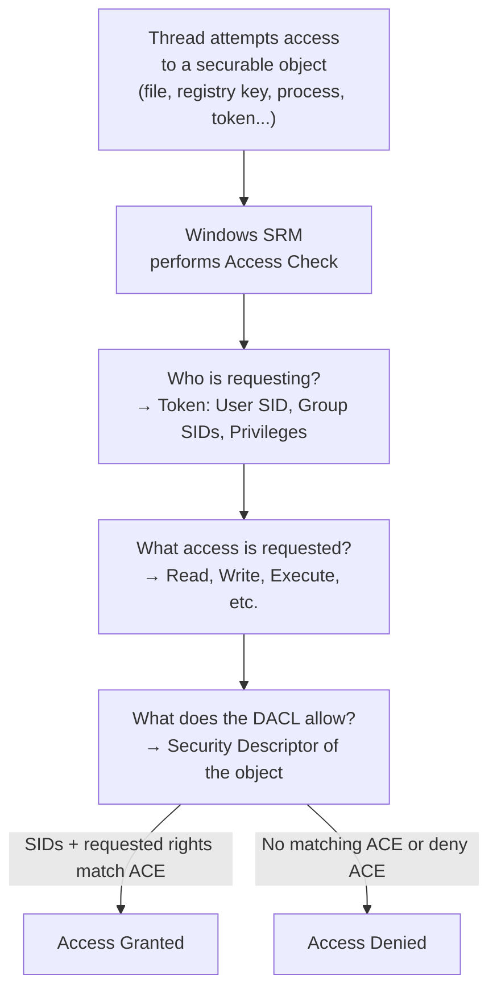

### UAC Token Split

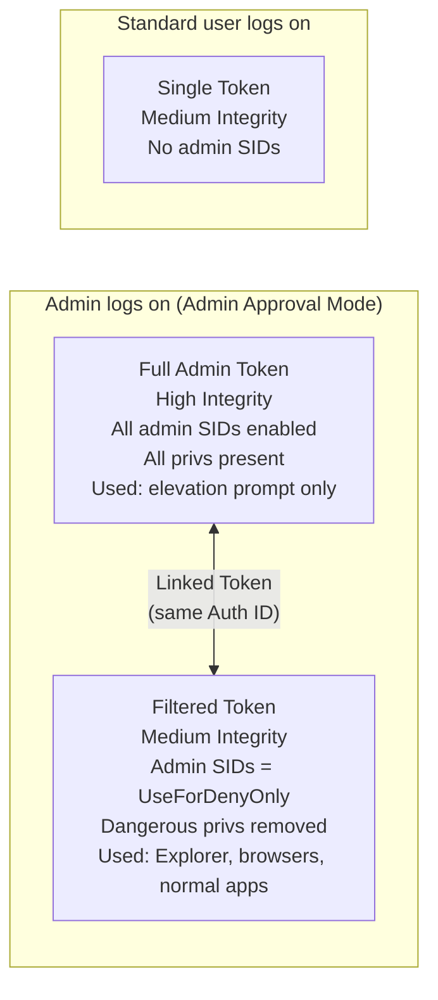

> **Attacker insight:** Remote connections by non-built-in admin accounts get the **filtered token only** by default (UAC remote restriction). Built-in local Administrator (RID 500) and domain admins are exempt. This is why attackers prefer domain admin accounts for remote operations.

---

## 6. Authentication Protocols: NTLM & Kerberos

### 6.1 NTLM Challenge-Response

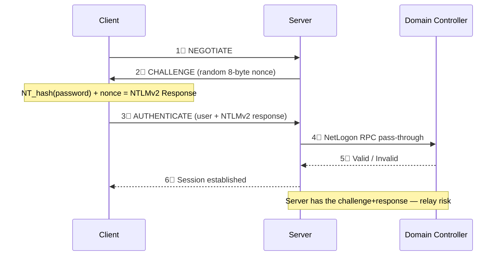

**Wireshark filter for NTLM challenge capture:**
```
ntlmssp.messagetype == 0x00000002
```

### 6.2 Kerberos Flow

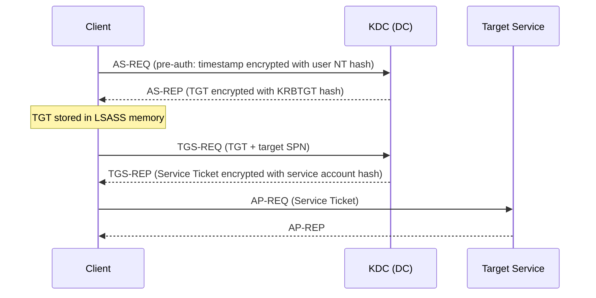

### 6.3 Attack vs. Defense Reference

| Attack | Protocol | MITRE | Key Detection |
|--------|---------|-------|--------------|
| Pass-the-Hash | NTLM | T1550.002 | Event 4624 Type 3, blank domain field |
| NTLM Relay | NTLM | T1557.001 | Multiple 4625 from same source IP |
| Pass-the-Ticket | Kerberos | T1550.003 | Ticket used from unexpected host |
| Kerberoasting | Kerberos TGS | T1558.003 | Event 4769, RC4 (0x17) encryption |
| AS-REP Roasting | Kerberos AS | T1558.004 | Event 4768, no pre-auth flag |
| Golden Ticket | KRBTGT hash | T1558.001 | Event 4672 + abnormal ticket lifetimes |
| Silver Ticket | Service hash | T1558.002 | No KDC event at all — bypasses DC |
| Overpass-the-Hash | NTLM→Kerberos | T1550.002 | RC4-encrypted TGT from unusual host |

---

## 7. Access Token Manipulation — T1134

This is the central technique for post-exploitation on Windows. Understanding the token model lets attackers **become any user on the system** without knowing credentials.

### 7.1 T1134 Sub-techniques Overview

```mermaid
mindmap
 root((T1134\nAccess Token\nManipulation))
 T1134.001[" Token Impersonation\n& Theft\nSteal from privileged process\nRequires SeDebugPrivilege\nor SeImpersonatePrivilege"]
 T1134.002[" Create Process\nwith Token\nCreateProcessWithTokenW\nCreateProcessAsUserA\nSpawn shell as stolen identity"]
 T1134.003[" Make and\nImpersonate Token\nLogonUser API\nImpersonateLoggedOnUser\nNeeds cleartext creds"]
 T1134.004[" Parent PID\nSpoofing\nHide malicious process\nunder legit parent\nEvades parent-based detection"]
 T1134.005[" SID-History\nInjection\nAdd foreign domain SID\nto account SID-History\nCross-domain privilege abuse"]
```

### 7.2 Full Token Impersonation Attack Chain

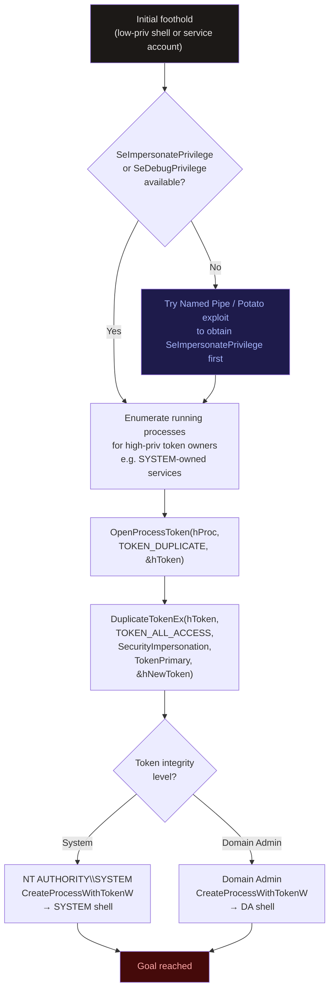

### 7.3 Make & Impersonate Token (T1134.003)

Used when the attacker has cleartext credentials and wants to run in the target's context without a visible interactive session.

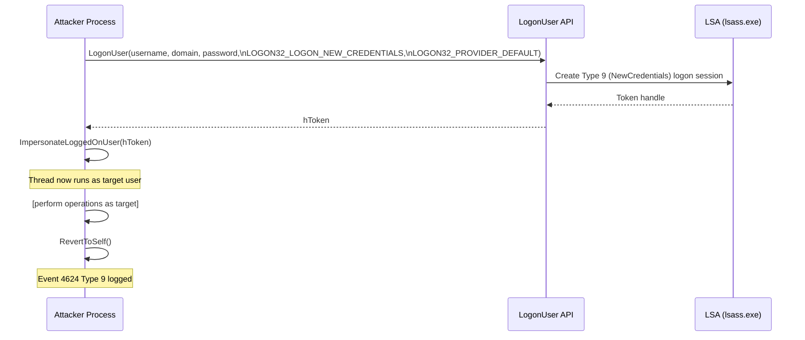

### 7.4 Meterpreter `getsystem` — Under the Hood

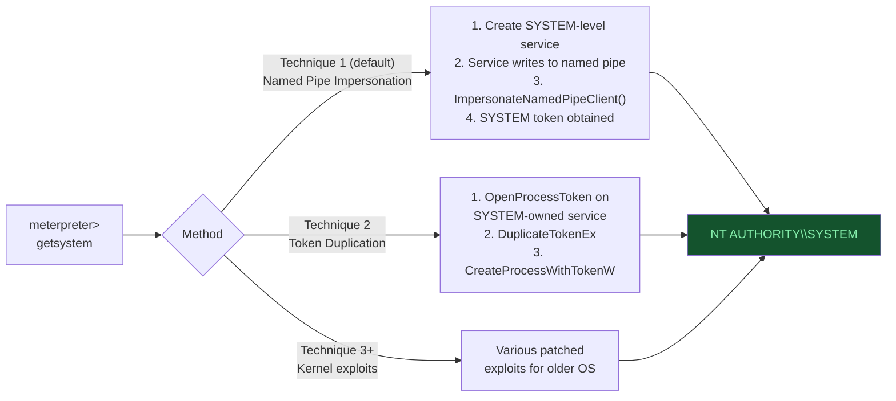

### 7.5 Win32 API Reference for T1134

| API | Purpose | Sub-technique |
|-----|---------|--------------|
| `LogonUser` / `LogonUserW` | Create token from explicit credentials | T1134.003 |
| `ImpersonateLoggedOnUser` | Apply token to calling thread | T1134.001/003 |
| `DuplicateToken` | Copy a token (same type) | T1134.001 |
| `DuplicateTokenEx` | Copy token, optionally change type | T1134.001/002 |
| `CreateProcessWithTokenW` | Spawn new process under stolen token | T1134.002 |
| `CreateProcessAsUserA` | Spawn process as user (needs quota privilege) | T1134.002 |
| `SetThreadToken` | Assign impersonation token to thread | T1134.001 |
| `ImpersonateNamedPipeClient` | Impersonate named pipe client | T1134.001 |
| `RpcImpersonateClient` | RPC-based impersonation | T1134.001 |
| `CoImpersonateClient` | COM-based impersonation | T1134.001 |
| `OpenProcessToken` | Get handle to process token (recon) | All |
| `OpenThreadToken` | Get handle to thread token (recon) | All |
| `RevertToSelf` | Drop impersonation | Cleanup |

---

## 8. Credential Access & Dumping

### 8.1 LSASS — The Token-Credential Vault

Every active logon session's credentials live in `lsass.exe` memory. Because access tokens link back to logon sessions (via LUID/AuthID), attackers who dump LSASS get both credentials **and** can reconstruct token context.

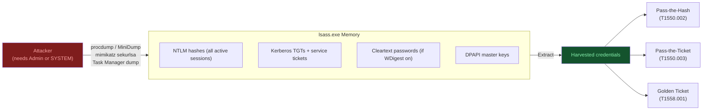

### 8.2 NTDS.dit — Full Domain Compromise

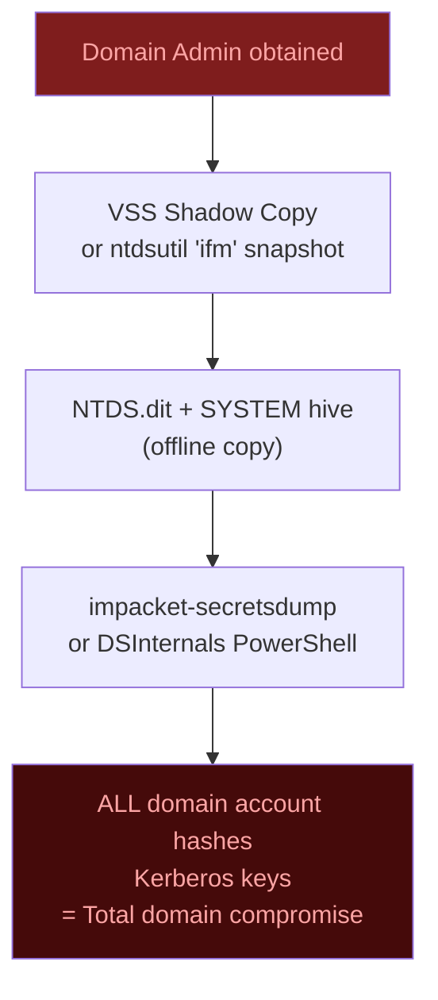

### 8.3 Credential Defense Controls

| Control | What It Stops | Implementation |
|---------|--------------|----------------|
| **Credential Guard** | LSASS token/hash theft (virtualizes LSASS) | GPO → Device Guard → Credential Guard |
| **Protected Users Group** | NTLM, WDigest, DES, unconstrained delegation | Add DA/EA to group |
| **Disable WDigest** | Plaintext password caching | `HKLM\...\WDigest: UseLogonCredential = 0` |
| **LSASS PPL** | Most dump techniques | `HKLM\...\Lsa: RunAsPPL = 1` |
| **EDR LSASS rule** | Process injection/read of lsass | Alert on PROCESS_ACCESS to lsass.exe |
| **Remove SeDebugPrivilege** | Token theft from privileged processes | GPO: User Rights Assignment |

---

## 9. Lateral Movement

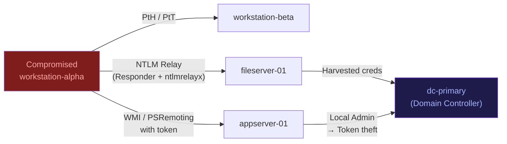

| Technique | Protocol | MITRE | Key Detection |
|-----------|---------|-------|--------------|
| Pass-the-Hash | SMB/WMI | T1550.002 | Event 4624 Type 3 + blank/workgroup domain |
| Pass-the-Ticket | Kerberos | T1550.003 | Ticket used from unexpected host/IP |
| NTLM Relay | SMB | T1557.001 | Multiple 4625 events from same source |
| WMI Execution | DCOM | T1047 | `WmiPrvSE.exe` spawning child processes |
| PsExec / Remote Services | SMB | T1021.002 | Event 7045: PSEXESVC service installed |
| RDP | RDP | T1021.001 | Event 4624 Type 10 from unusual source |
| Token-based (T1134.002) | Any | T1134.002 | Event 4648 — explicit credential logon |

---

## 10. Persistence Mechanisms

```mermaid
mindmap
 root((AD Persistence\nStrategies))
 Domain[" Domain-Level"]
 GoldenTkt["Golden Ticket\nKRBTGT hash\nT1558.001"]
 DCSync["DCSync backdoor\nGrant replication rights\nto low-priv account"]
 AdminSDH["AdminSDHolder\nACL injection\nSurvives SDProp"]
 MalGPO["Malicious GPO\nstartup script or\nscheduled task"]
 Host[" Host-Level"]
 Sched["Scheduled Task\nT1053.005"]
 RegRun["Registry Run Keys\nT1547.001"]
 Service["Malicious Service\nT1543.003"]
 OutlookHP["Outlook Home Page\nT1137.004"]
 Credential[" Credential-Based"]
 SIDHist["SID-History Injection\nT1134.005\nCross-domain access"]
 ShadowCred["Shadow Credentials\nmsDS-KeyCredentialLink"]
 ADCS["ADCS Cert Abuse\nESC1-8 paths"]
```

---

## 11. Silver SAML & Entra ID Attacks

Silver SAML targets federated authentication in Entra ID. An attacker with sufficient privileges adds a rogue signing certificate to a service principal, then forges SAML assertions for any user — bypassing MFA.

### 11.1 Silver SAML Attack Flow

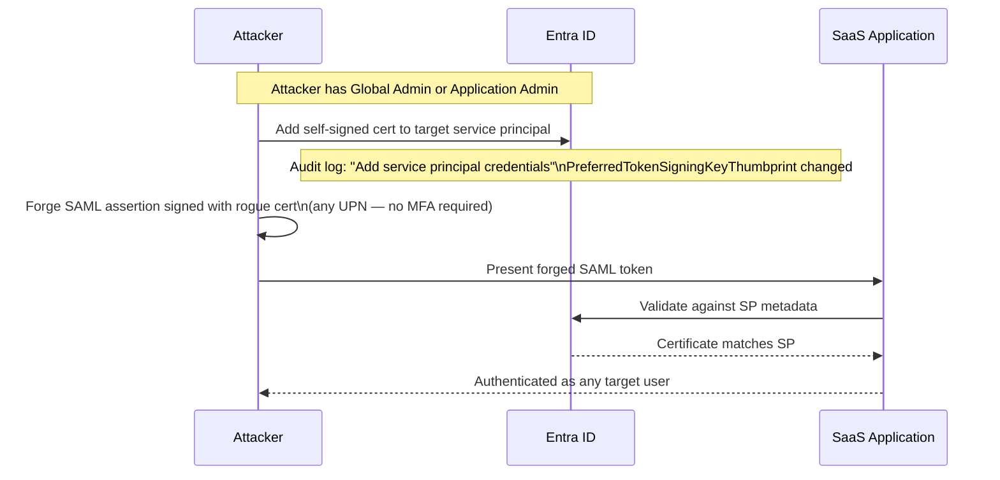

### 11.2 KQL Detection (Microsoft Sentinel)

**Detect rogue cert added to service principal:**
```kql
AuditLogs_CL
| where Category == "ApplicationManagement"
| where Activity == "Add service principal credentials"
| project EventTime, IPAddress, Category, Activity,
 ActorUserPrincipalName, Target1DisplayName,
 PropertyChanged, PropertyOldValue, PropertyNewValue
```

**Detect signing key thumbprint modification:**
```kql
AuditLogs_CL
| where Category == "ApplicationManagement"
| where Activity == "Update service principal"
| where PropertyChanged == "PreferredTokenSigningKeyThumbprint"
| project EventTime, IPAddress, Activity, ActorUserPrincipalName,
 Target1DisplayName, PropertyChanged, PropertyOldValue, PropertyNewValue
```

### 11.3 Golden SAML vs. Silver SAML

| Dimension | Golden SAML | Silver SAML |
|-----------|------------|------------|
| **Target** | On-prem ADFS | Entra ID (cloud) |
| **Requires** | ADFS signing cert theft | Permission to add cert to SP |
| **Scope** | All ADFS-federated apps | Specific service principal |
| **Detection** | ADFS server logs | Entra ID Audit Logs |
| **MITRE** | T1606.002 | T1606.002 (variation) |

---

## 12. Detection Engineering & Log Analysis

### 12.1 Critical Windows Event IDs

| Event ID | Source | Description | Attack Relevance |
|----------|--------|-------------|-----------------|
| **4624** | Security | Successful logon | Lateral movement (Type 3/9/10) |
| **4625** | Security | Failed logon | Brute force / spray |
| **4648** | Security | Explicit credential logon | Token manipulation T1134.003 |
| **4662** | Security | AD object access | DCSync detection |
| **4672** | Security | Special privileges assigned at logon | Token abuse, admin access |
| **4688** | Security | New process created | Malicious execution chains |
| **4698** | Security | Scheduled task created | Persistence |
| **4768** | Security | Kerberos TGT requested | AS-REP Roasting |
| **4769** | Security | Kerberos TGS requested | Kerberoasting (RC4 = 0x17) |
| **4771** | Security | Kerberos pre-auth failed | Password spraying |
| **7045** | System | New service installed | PsExec lateral movement |
| **90018** | Security | Token elevation enabled | Token manipulation |

### 12.2 KQL — Kerberoasting Detection

```kql
SecurityEvent
| where EventID == 4769
| where TicketEncryptionType == "0x17" // RC4-HMAC — weak, legacy
| where ServiceName !endswith "$" // Skip machine accounts
| where ServiceName != "krbtgt"
| summarize count() by AccountName, IPAddress, bin(TimeGenerated, 5m)
| where count_ > 3
| order by count_ desc
```

### 12.3 Conceptual Sigma Rule — T1134.002

```yaml
title: Suspicious Process Spawned Under Service Context (Token Impersonation)
status: experimental
description: Detects command shells spawned by services with SYSTEM integrity,
 typical of T1134.002 token-based privilege escalation.
logsource:
 product: windows
 category: process_creation
detection:
 selection_parent:
 ParentImage|endswith:
 - '\services.exe'
 - '\svchost.exe'
 selection_integrity:
 IntegrityLevel: 'System'
 selection_target:
 Image|endswith:
 - '\cmd.exe'
 - '\powershell.exe'
 - '\whoami.exe'
 condition: all of selection_*
falsepositives:
 - Legitimate admin tooling
level: high
tags:
 - attack.privilege_escalation
 - attack.t1134.002
```

### 12.4 Sysmon Events for T1134 Coverage

| Event ID | Triggers | Catches |
|----------|---------|---------|
| 1 — ProcessCreate | All process creations | Token-based spawning |
| 8 — CreateRemoteThread | Cross-process thread | Token theft via injection |
| 10 — ProcessAccess | LSASS read/write | Credential + token dumping |
| 25 — ProcessTampering | Hollowing/herpaderp | Advanced token abuse |

---

## 13. Defense-in-Depth Blueprint

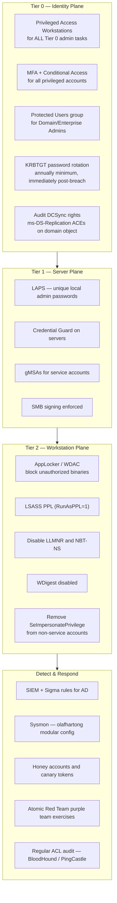

### Quick Defense Reference

| Attack | Primary Defense | Detection Signal |
|--------|----------------|-----------------|
| Pass-the-Hash | Credential Guard, LAPS, disable NTLMv1 | Event 4624 Type 3, anomalous source |
| Kerberoasting | gMSAs, 25+ char service account passwords | Event 4769 RC4 encryption |
| Token Manipulation | Remove SeImpersonatePrivilege, PPL | Event 4624 Type 9, Event 4672 |
| Golden Ticket | Rotate KRBTGT ×2, Protected Users | Event 4672 + abnormal ticket lifetimes |
| NTLM Relay | SMB signing, disable LLMNR/NBT-NS | Multiple 4625 from same source |
| Silver SAML | Audit SP cert additions, restrict cloud admin | Entra Audit: cert + SP modifications |
| DCSync | Restrict replication rights, audit ACLs | Event 4662 with replication GUIDs |
| ADCS Abuse | Audit ESC1-8 templates, manager approval | CA request anomalies |

---

## 14. References

### MITRE ATT&CK
- [T1134 — Access Token Manipulation](https://attack.mitre.org/techniques/T1134/)
- [T1134.001 — Token Impersonation/Theft](https://attack.mitre.org/techniques/T1134/001/)
- [T1134.002 — Create Process with Token](https://attack.mitre.org/techniques/T1134/002/)
- [T1134.003 — Make and Impersonate Token](https://attack.mitre.org/techniques/T1134/003/)
- [T1558 — Steal or Forge Kerberos Tickets](https://attack.mitre.org/techniques/T1558/)
- [T1550 — Use Alternate Authentication Material](https://attack.mitre.org/techniques/T1550/)
- [T1606.002 — SAML Token Forgery](https://attack.mitre.org/techniques/T1606/002/)

### Microsoft Documentation
- [Access Tokens (Win32)](https://docs.microsoft.com/en-us/windows/win32/secauthz/access-tokens)
- [Client Impersonation](https://docs.microsoft.com/en-us/windows/win32/secauthz/client-impersonation)
- [Impersonation Levels](https://learn.microsoft.com/en-us/windows/win32/com/impersonation-levels)
- [Impersonation Tokens](https://docs.microsoft.com/en-us/windows/win32/secauthz/impersonation-tokens)
- [How UAC Works](https://docs.microsoft.com/en-us/windows/security/identity-protection/user-account-control/how-user-account-control-works)
- [UAC and Remote Restrictions](https://learn.microsoft.com/en-us/troubleshoot/windows-server/windows-security/user-account-control-and-remote-restriction)
- [LogonUser API](https://learn.microsoft.com/en-us/windows/win32/api/winbase/nf-winbase-logonuserw)
- [DuplicateTokenEx](https://learn.microsoft.com/en-us/windows/win32/api/securitybaseapi/nf-securitybaseapi-duplicatetokenex)
- [CreateProcessWithTokenW](https://learn.microsoft.com/en-us/windows/win32/api/winbase/nf-winbase-createprocesswithtokenw)
- [ImpersonateNamedPipeClient](https://learn.microsoft.com/en-us/windows/win32/api/namedpipeapi/nf-namedpipeapi-impersonatenamedpipeclient)
- [OpenThreadToken](https://docs.microsoft.com/en-us/windows/win32/api/processthreadsapi/nf-processthreadsapi-openthreadtoken)
- [Windows Logon Scenarios](https://docs.microsoft.com/en-us/windows-server/security/windows-authentication/windows-logon-scenarios)
- [SECURITY_IMPERSONATION_LEVEL enumeration](https://docs.microsoft.com/en-us/windows/win32/api/winnt/ne-winnt-security_impersonation_level)

### Detection & Tooling
- [SigmaHQ — T1134 Detection Rules](https://github.com/search?q=repo%3ASigmaHQ%2Fsigma+t1134&type=issues)
- [Sysmon Modular Config — olafhartong](https://github.com/olafhartong/sysmon-modular)
- [Atomic Red Team — T1134](https://github.com/redcanaryco/atomic-red-team)
- [Atomic Red Team — T1137.004](https://github.com/redcanaryco/atomic-red-team/blob/master/atomics/T1137.004/T1137.004.md)
- [PowerSploit — Invoke-TokenManipulation](https://github.com/PowerShellMafia/PowerSploit/blob/master/Exfiltration/Invoke-TokenManipulation.ps1)
- [Google Project Zero — TokenViewer](https://github.com/googleprojectzero/sandbox-attacksurface-analysis-tools/tree/main/TokenViewer)
- [Elastic — Abusing Access Token Manipulation](https://www.elastic.co/blog/how-attackers-abuse-access-token-manipulation)
- [Metasploit getsystem documentation](https://docs.rapid7.com/metasploit/meterpreter-getsystem/)
- [Uncoder.io — Rule Translation](https://uncoder.io/)
- [EQL Analytics Library — Token Manipulation](https://eqllib.readthedocs.io/en/latest/analytics/19d59f40-12fc-11e9-8d76-4d6bb837cda4.html)
- [ControlCompass — T1134.001](https://github.com/ControlCompass/ControlCompass.github.io/blob/main/resources/T1134.001.md)

### Event Log Reference
- [Ultimate Windows Security — Event Encyclopedia](https://www.ultimatewindowssecurity.com/securitylog/encyclopedia/event.aspx?eventid=90018)
- [Ultimate Windows Security — Log Book Ch.5](https://www.ultimatewindowssecurity.com/securitylog/book/page.aspx?spid=chapter5)
- [Ultimate Windows Security — Log Book Ch.7](https://www.ultimatewindowssecurity.com/securitylog/book/page.aspx?spid=chapter7)

### Books & Courses
- Yosifovich et al. (2017). *Windows Internals, Part 1*, 7th Edition.
- MITRE MAD20. (2023). *ATT&CK Access Tokens Technical Primer*.
- Elastic (2020). *Introduction to Windows Tokens for Security Practitioners*.

### Threat Intelligence
- [FIN8 Deep Dive — Bitdefender](https://businessinsights.bitdefender.com/deep-dive-into-a-fin8-attack-a-forensic-investigation)
- [CyberDefenders — Silver SAML Lab](https://cyberdefenders.org/online-labs/labs/lab-212-saml-authentication-and-silver-saml-in-entra-id-new/)

---

*Written by [TheCyberDefenseGuy](https://github.com/TheCyberDefenseGuy) — PRs and corrections welcome.*
