# Active Directory Attack and Defense - A Technical Reference

**Autor:** [TheCyberDefenseGuy](https://github.com/TheCyberDefenseGuy)
**Tags:** `Active Directory` `Red Team` `Blue Team` `MITRE ATT&CK` `T1134` `Windows Security` `Kerberos` `NTLM`
**Nível:** Intermediário → Avançado
**Atualizado:** 2026

---

## Índice

1. [A Anatomia de um Domínio](#1-a-anatomia-de-um-domínio)
2. [Logon Sessions - A Fundação](#2-logon-sessions--a-fundação)
3. [Access Tokens em Profundidade](#3-access-tokens-em-profundidade)
4. [Tokens Primários vs. Tokens de Impersonation](#4-tokens-primários-vs-tokens-de-impersonation)
5. [Access Checks e UAC](#5-access-checks-e-uac)
6. [Protocolos de Autenticação: NTLM e Kerberos](#6-protocolos-de-autenticação-ntlm-e-kerberos)
7. [Manipulação de Access Token - T1134](#7-manipulação-de-access-token--t1134)
8. [Acesso e Extração de Credenciais](#8-acesso-e-extração-de-credenciais)
9. [Movimento Lateral](#9-movimento-lateral)
10. [Mecanismos de Persistência](#10-mecanismos-de-persistência)
11. [Silver SAML e Ataques ao Entra ID](#11-silver-saml-e-ataques-ao-entra-id)
12. [Engenharia de Detecção e Análise de Logs](#12-engenharia-de-detecção-e-análise-de-logs)
13. [Blueprint de Defesa em Profundidade](#13-blueprint-de-defesa-em-profundidade)
14. [Referências](#14-referências)

---

## 1. A Anatomia de um Domínio

O Active Directory é um serviço de diretório hierárquico construído sobre LDAP e Kerberos, responsável por gerenciar identidades, confiança e acesso em toda a organização. Antes de atacar ou defender, é preciso entender o terreno.

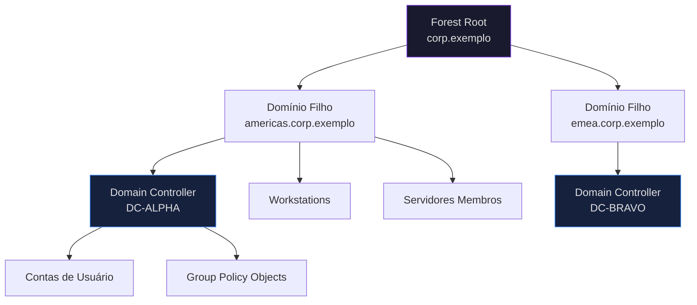

### Objetos Chave do AD - Matriz de Ataque e Defesa

| Objeto | Função | Objetivo do Atacante | Prioridade do Defensor |
|--------|--------|---------------------|----------------------|
| **Domain Controller** | Hospeda NTDS.dit, autentica usuários | Alvo principal - acesso total ao domínio | Proteção Tier 0, acesso apenas via PAW |
| **Conta KRBTGT** | Assina todos os tickets Kerberos | Obter o hash → Golden Ticket | Rotacionar senha regularmente (×2) |
| **GPO** | Aplica configurações em todo o domínio | Persistência, implantação de malware em massa | Auditar permissões e links de GPO |
| **Contas de Serviço** | Executam serviços com direitos delegados | Alvo do Kerberoasting | Usar gMSAs, princípio do menor privilégio |
| **Relações de Confiança** | Conectam domínios e florestas | Pivô entre domínios | Restringir SID filtering |
| **AdminSDHolder** | Protege ACLs de grupos privilegiados | Backdoor via injeção de ACL | Monitorar alterações de ACL a cada ciclo SDProp |
| **Templates ADCS** | Emitem certificados | Caminhos de ataque ESC1-8 | Auditar permissões de templates |

---

## 2. Logon Sessions - A Fundação

Antes de os access tokens existirem, as logon sessions precisam ser criadas. Esse é o alicerce de todo o modelo de identidade do Windows - e a base que atacantes precisam entender para explorar o sistema.

> **Insight chave:** Uma logon session é criada quando o usuário se autentica com sucesso. Todo access token está vinculado a uma logon session por meio de um **Logon ID (LUID)**. Essa relação é o que os atacantes exploram na manipulação de tokens.

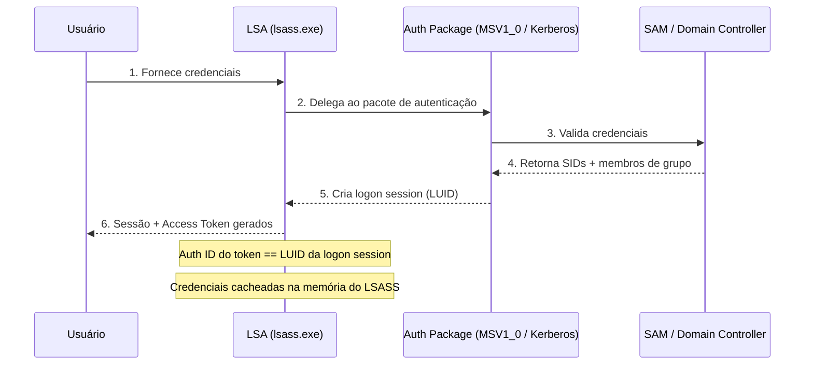

### Tipos de Logon - Evento 4624

| Código | Nome | Gerado Por | Relevância para Ataques |
|--------|------|-----------|------------------------|
| 2 | Interactive | Login no console físico | Login padrão de usuário |
| 3 | Network | SMB, unidades mapeadas | Pass-the-Hash, movimento lateral |
| 4 | Batch | Tarefas agendadas | Persistência |
| 5 | Service | Inicialização de serviços | Roubo de token de serviços |
| 9 | NewCredentials | `runas /netonly` | **Indicador chave de manipulação de token** |
| 10 | RemoteInteractive | RDP | Movimento lateral via RDP |

> **UAC - Admin Approval Mode:** Quando um administrador faz login interativo, o Windows cria **dois tokens vinculados**: um token filtrado padrão (integridade média, usado pelo Explorer) e um token admin completo (integridade alta, usado apenas em elevação de privilégio). O token filtrado tem os SIDs de grupo admin definidos como `UseForDenyOnly` e os privilégios perigosos removidos.

---

## 3. Access Tokens em Profundidade

Um **access token** é o objeto de segurança usado pelo Security Reference Monitor (SRM) do Windows para descrever o contexto de segurança de um processo ou thread. Todo processo possui um - e atacantes que conseguem manipulá-lo podem se passar por qualquer usuário no sistema sem precisar da senha.

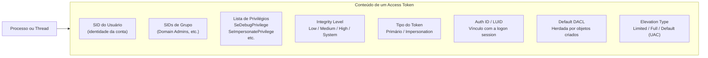

### Campos que Atacantes Mais Exploram

| Campo | Por Que É Alvo de Ataques |
|-------|--------------------------|
| **SIDs de Grupo** | SID Domain Admins = acesso total ao domínio |
| **SeImpersonatePrivilege** | Permite roubar tokens de outros processos - caminho dos exploits "Potato" |
| **SeDebugPrivilege** | Permite abrir qualquer processo → dump do LSASS → todas as credenciais |
| **Integrity Level** | Deve ser High/System para operações privilegiadas |
| **Tipo do Token** | Impersonation token necessário para impersonação em nível de thread |
| **Auth ID / LUID** | Identifica qual logon session guarda as credenciais no LSASS |
| **Elevation Type** | "Limited" = token filtrado (UAC). "Full" = elevado. |

### APIs Windows para Inspeção de Token

| API | Função |
|-----|--------|
| `OpenProcessToken` | Obtém handle para o token primário de um processo |
| `OpenThreadToken` | Obtém handle para o token de impersonation de uma thread |
| `GetTokenInformation` | Lê campos do token |
| `SetTokenInformation` | Modifica campos do token |

---

## 4. Tokens Primários vs. Tokens de Impersonation

Essa distinção é o coração mecânico de como os ataques baseados em token funcionam.

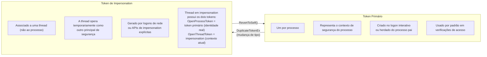

### Níveis de Impersonation - A Escada de Escalação

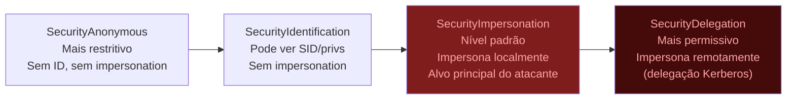

### Pontos Críticos

- `CreateProcess` - processos filhos **sempre herdam o token primário**, nunca o de impersonation
- Não é possível impersonar um token de **integridade mais alta** que a atual
- Threads devem chamar `RevertToSelf()` para retornar ao contexto primário - falhar nisso é indicador de ataque
- **Logons de rede** (Tipo 3) geram **tokens de impersonation** - não primários
- **Logons interativos** (Tipo 2) geram **tokens primários**

---

## 5. Access Checks e UAC

### Como o Windows Decide: Essa Thread Pode Acessar Esse Objeto?

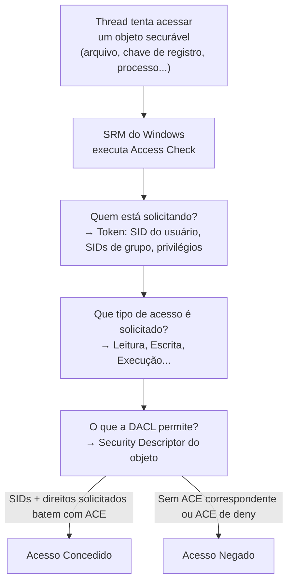

### Divisão de Tokens no UAC

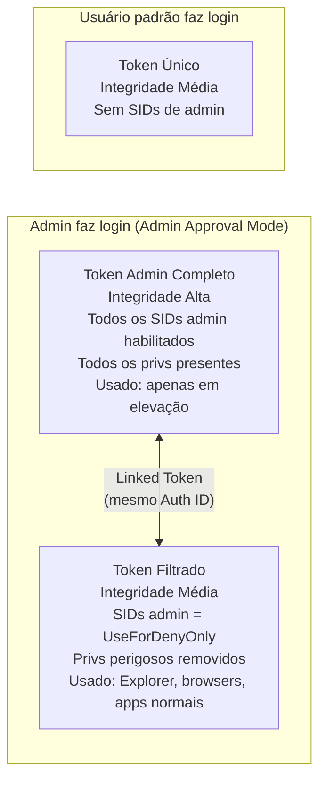

> **Insight para o atacante:** Conexões remotas de contas admin não-nativas recebem **apenas o token filtrado** por padrão (restrição remota do UAC). O Administrador local nativo (RID 500) e admins de domínio são isentos. Por isso atacantes preferem contas de administrador de domínio para operações remotas.

---

## 6. Protocolos de Autenticação: NTLM e Kerberos

### 6.1 NTLM Challenge-Response

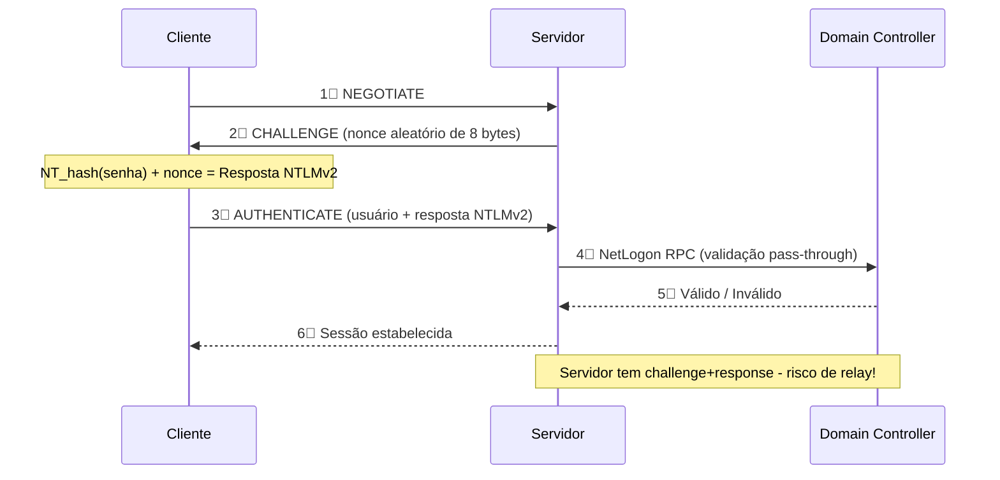

**Filtro Wireshark para capturar desafios NTLM:**
```
ntlmssp.messagetype == 0x00000002
```

### 6.2 Fluxo Kerberos

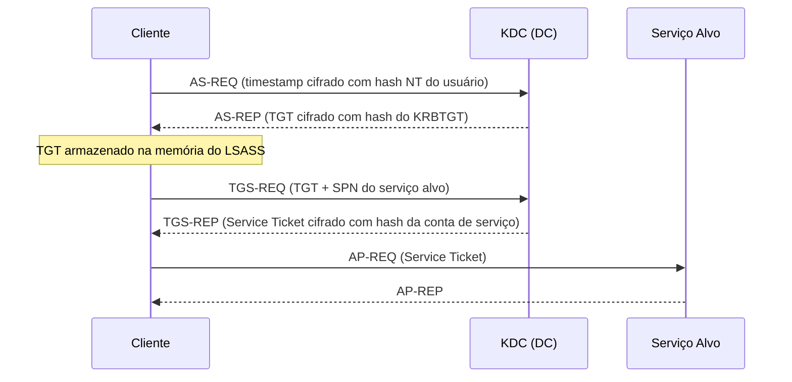

### 6.3 Referência Rápida - Ataque vs. Defesa

| Ataque | Protocolo | MITRE | Detecção Principal |
|--------|---------|-------|-------------------|
| Pass-the-Hash | NTLM | T1550.002 | Evento 4624 Tipo 3, campo de domínio vazio |
| NTLM Relay | NTLM | T1557.001 | Múltiplos 4625 do mesmo IP de origem |
| Pass-the-Ticket | Kerberos | T1550.003 | Ticket usado de host inesperado |
| Kerberoasting | TGS Kerberos | T1558.003 | Evento 4769, criptografia RC4 (0x17) |
| AS-REP Roasting | AS Kerberos | T1558.004 | Evento 4768, pré-autenticação desabilitada |
| Golden Ticket | Hash KRBTGT | T1558.001 | Evento 4672 + tempo de vida de ticket anormal |
| Silver Ticket | Hash de serviço | T1558.002 | Nenhum evento no DC - bypassa o KDC |
| Overpass-the-Hash | NTLM→Kerberos | T1550.002 | TGT com RC4 de host incomum |

---

## 7. Manipulação de Access Token - T1134

Esta é a técnica central do pós-comprometimento no Windows. Entender o modelo de tokens permite que atacantes **se tornem qualquer usuário no sistema** sem saber a senha.

### 7.1 Mapa Mental das Sub-técnicas T1134

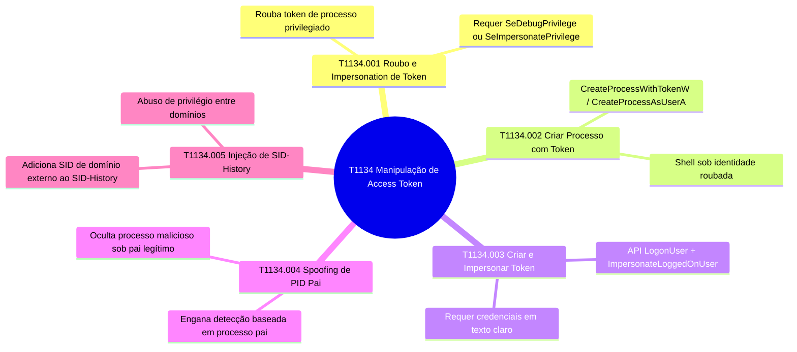

### 7.2 Cadeia Completa de Ataque por Impersonation de Token

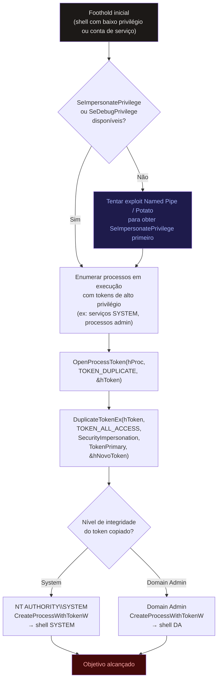

### 7.3 Make & Impersonate Token (T1134.003)

Usado quando o atacante tem as credenciais em texto claro e quer executar código no contexto do alvo sem uma sessão interativa visível.

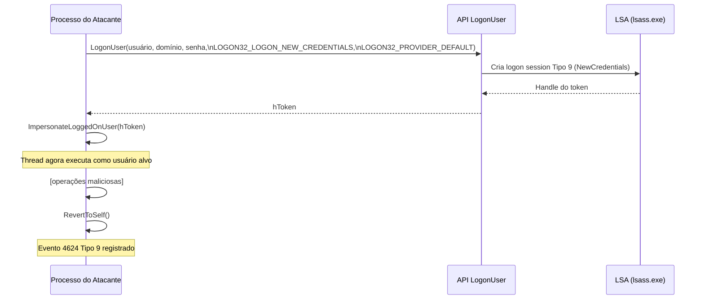

### 7.4 Meterpreter `getsystem` - Por Dentro

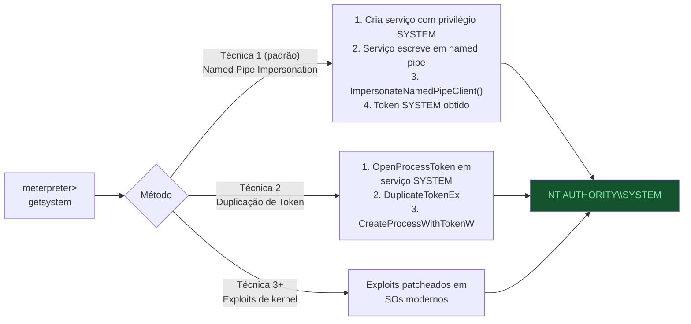

### 7.5 Referência Completa de APIs Win32 para T1134

| API | Função | Sub-técnica |
|-----|--------|------------|
| `LogonUser` / `LogonUserW` | Cria token a partir de credenciais explícitas | T1134.003 |
| `ImpersonateLoggedOnUser` | Aplica token à thread chamante | T1134.001/003 |
| `DuplicateToken` | Copia um token (mesmo tipo) | T1134.001 |
| `DuplicateTokenEx` | Copia token, pode mudar tipo | T1134.001/002 |
| `CreateProcessWithTokenW` | Cria processo sob token roubado | T1134.002 |
| `CreateProcessAsUserA` | Cria processo como usuário (precisa de quota priv) | T1134.002 |
| `SetThreadToken` | Atribui token de impersonation à thread | T1134.001 |
| `ImpersonateNamedPipeClient` | Impersona cliente de named pipe | T1134.001 |
| `RpcImpersonateClient` | Impersonation via RPC | T1134.001 |
| `CoImpersonateClient` | Impersonation via COM | T1134.001 |
| `OpenProcessToken` | Obtém handle para token de processo | Reconhecimento |
| `OpenThreadToken` | Obtém handle para token de thread | Reconhecimento |
| `RevertToSelf` | Abandona impersonation | Limpeza |

---

## 8. Acesso e Extração de Credenciais

### 8.1 LSASS - O Cofre de Tokens e Credenciais

Cada logon session ativa tem suas credenciais armazenadas na memória do `lsass.exe`. Como os access tokens estão vinculados a logon sessions (via LUID/AuthID), atacantes que despejam o LSASS obtêm tanto credenciais quanto podem reconstruir o contexto de token.

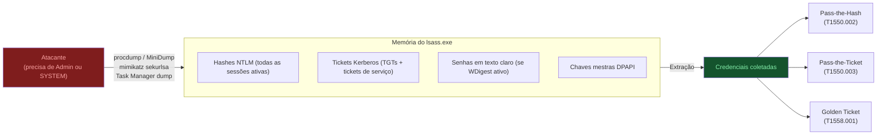

### 8.2 NTDS.dit - O Comprometimento Total do Domínio

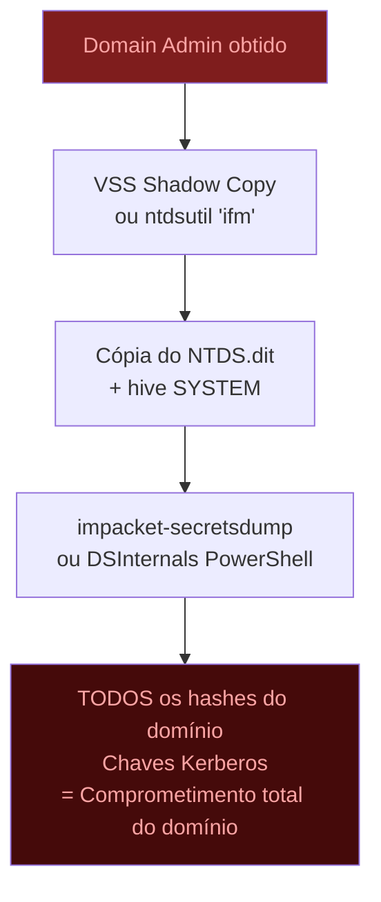

### 8.3 Controles de Defesa para Credenciais

| Controle | O Que Previne | Como Implementar |
|---------|--------------|-----------------|
| **Credential Guard** | Roubo de token/hash do LSASS (virtualiza o LSASS) | GPO → Device Guard → Credential Guard |
| **Protected Users Group** | NTLM, WDigest, DES, delegação irrestrita | Adicionar contas DA/EA ao grupo |
| **Desabilitar WDigest** | Cache de senha em texto claro | `HKLM\...\WDigest: UseLogonCredential = 0` |
| **LSASS PPL (RunAsPPL)** | Maioria das técnicas de dump | `HKLM\...\Lsa: RunAsPPL = 1` |
| **Regra EDR para LSASS** | Injeção e leitura de memória | Alerta em PROCESS_ACCESS ao lsass.exe |
| **Remover SeDebugPrivilege** | Roubo de token de processos privilegiados | GPO: Atribuição de Direitos de Usuário |

---

## 9. Movimento Lateral

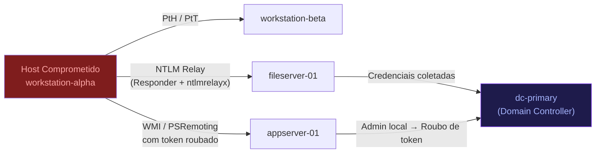

| Técnica | Protocolo | MITRE | Detecção |
|---------|---------|-------|---------|
| Pass-the-Hash | SMB/WMI | T1550.002 | Evento 4624 Tipo 3, campo de domínio vazio |
| Pass-the-Ticket | Kerberos | T1550.003 | Ticket usado de IP inesperado |
| NTLM Relay | SMB | T1557.001 | Múltiplos eventos 4625 da mesma origem |
| Execução WMI | DCOM | T1047 | `WmiPrvSE.exe` gerando processos filhos |
| PsExec / Serviços Remotos | SMB | T1021.002 | Evento 7045: serviço PSEXESVC instalado |
| RDP | RDP | T1021.001 | Evento 4624 Tipo 10 de origem incomum |
| Via Token (T1134.002) | Qualquer | T1134.002 | Evento 4648 - logon com credenciais explícitas |

---

## 10. Mecanismos de Persistência

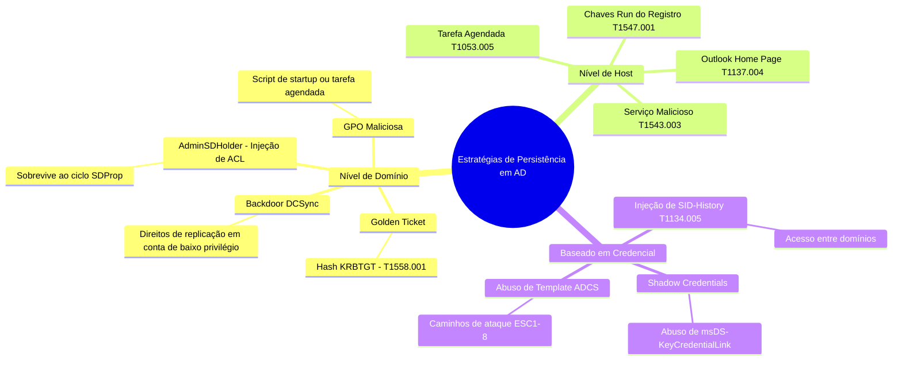

---

## 11. Silver SAML e Ataques ao Entra ID

O Silver SAML ataca a autenticação federada no Entra ID. Um atacante com permissões suficientes adiciona um certificado de assinatura falso a um service principal e então forja asserções SAML para qualquer usuário - bypassando o MFA.

### 11.1 Fluxo do Ataque Silver SAML

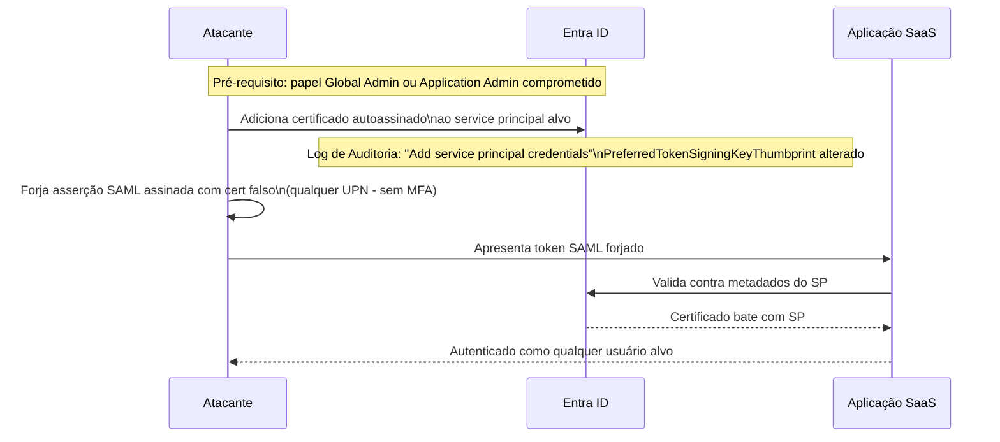

### 11.2 Queries KQL para Detecção (Microsoft Sentinel)

**Detectar certificado falso adicionado ao service principal:**
```kql
AuditLogs_CL
| where Category == "ApplicationManagement"
| where Activity == "Add service principal credentials"
| project EventTime, IPAddress, Category, Activity,
 ActorUserPrincipalName, Target1DisplayName,
 PropertyChanged, PropertyOldValue, PropertyNewValue
```

**Detectar modificação de thumbprint de chave de assinatura:**
```kql
AuditLogs_CL
| where Category == "ApplicationManagement"
| where Activity == "Update service principal"
| where PropertyChanged == "PreferredTokenSigningKeyThumbprint"
| project EventTime, IPAddress, Activity, ActorUserPrincipalName,
 Target1DisplayName, PropertyChanged, PropertyOldValue, PropertyNewValue
```

### 11.3 Golden SAML vs. Silver SAML

| Dimensão | Golden SAML | Silver SAML |
|----------|------------|------------|
| **Alvo** | ADFS on-premises | Entra ID (nuvem) |
| **O que precisa** | Roubo do cert de assinatura ADFS | Permissão para adicionar cert ao SP |
| **Escopo** | Todos os apps federados via ADFS | Service principal específico |
| **Onde detectar** | Logs do servidor ADFS | Logs de Auditoria do Entra ID |
| **MITRE** | T1606.002 | T1606.002 (variação) |

---

## 12. Engenharia de Detecção e Análise de Logs

### 12.1 Event IDs Críticos do Windows

| Event ID | Fonte | Descrição | Relevância para Ataques |
|----------|-------|-----------|------------------------|
| **4624** | Security | Logon bem-sucedido | Movimento lateral (Tipo 3/9/10) |
| **4625** | Security | Logon falhou | Força bruta / password spray |
| **4648** | Security | Logon com credenciais explícitas | Manipulação de token T1134.003 |
| **4662** | Security | Acesso a objeto AD | Detecção de DCSync |
| **4672** | Security | Privilégios especiais atribuídos no logon | Abuso de token, acesso admin |
| **4688** | Security | Novo processo criado | Cadeias de execução maliciosa |
| **4698** | Security | Tarefa agendada criada | Persistência |
| **4768** | Security | TGT Kerberos solicitado | AS-REP Roasting |
| **4769** | Security | Ticket de serviço Kerberos solicitado | Kerberoasting (RC4 = 0x17) |
| **4771** | Security | Falha de pré-autenticação Kerberos | Password spraying |
| **7045** | System | Novo serviço instalado | PsExec, movimento lateral |
| **90018** | Security | Elevação de token habilitada | Manipulação de token |

### 12.2 KQL - Detecção de Kerberoasting

```kql
SecurityEvent
| where EventID == 4769
| where TicketEncryptionType == "0x17" // RC4-HMAC - fraco e legado
| where ServiceName !endswith "$" // Ignorar contas de máquina
| where ServiceName != "krbtgt"
| summarize Solicitacoes = count() by AccountName, IPAddress, bin(TimeGenerated, 5m)
| where Solicitacoes > 3
| order by Solicitacoes desc
```

### 12.3 Regra Sigma Conceitual - T1134.002

```yaml
title: Processo Suspeito Criado sob Contexto de Serviço (Impersonation de Token)
status: experimental
description: Detecta shells de comando criados por serviços com integridade SYSTEM,
 típico de escalação de privilégio T1134.002 via token.
logsource:
 product: windows
 category: process_creation
detection:
 selection_pai:
 ParentImage|endswith:
 - '\services.exe'
 - '\svchost.exe'
 selection_integridade:
 IntegrityLevel: 'System'
 selection_alvo:
 Image|endswith:
 - '\cmd.exe'
 - '\powershell.exe'
 - '\whoami.exe'
 condition: all of selection_*
falsepositives:
 - Ferramentas administrativas legítimas em contexto de serviço
level: high
tags:
 - attack.privilege_escalation
 - attack.t1134.002
```

### 12.4 Cobertura Sysmon para T1134

| Evento Sysmon | Quando Dispara | O Que Captura |
|---------------|--------------|--------------|
| 1 - ProcessCreate | Toda criação de processo | Spawn baseado em token |
| 8 - CreateRemoteThread | Thread em processo externo | Roubo de token via injeção |
| 10 - ProcessAccess | Leitura/escrita no LSASS | Dump de credenciais e tokens |
| 25 - ProcessTampering | Hollowing / herpaderping | Abuso avançado de token |

---

## 13. Blueprint de Defesa em Profundidade

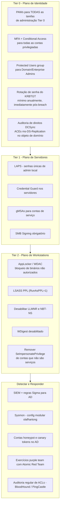

### Cartão de Referência Rápida de Defesa

| Ataque | Defesa Principal | Sinal de Detecção |
|--------|----------------|------------------|
| Pass-the-Hash | Credential Guard, LAPS, desabilitar NTLMv1 | Evento 4624 Tipo 3, origem anômala |
| Kerberoasting | gMSAs, senhas longas aleatórias | Evento 4769 criptografia RC4 |
| Manipulação de Token | Remover SeImpersonatePrivilege, PPL | Evento 4624 Tipo 9, Evento 4672 |
| Golden Ticket | Rotação KRBTGT ×2, Protected Users | Evento 4672 + tempo de vida de ticket anormal |
| NTLM Relay | SMB Signing, desabilitar LLMNR/NBT-NS | Múltiplos 4625 da mesma origem |
| Silver SAML | Auditoria de certs de SP, restringir admin cloud | Entra Audit: modificações de cert/SP |
| DCSync | Restringir direitos de replicação, auditar ACLs | Evento 4662 com GUIDs de replicação |
| Abuso ADCS | Auditar templates ESC1-8, aprovação de gerente | Anomalias em solicitações de cert |

---

## 14. Referências

### MITRE ATT&CK
- [T1134 - Access Token Manipulation](https://attack.mitre.org/techniques/T1134/)
- [T1134.001 - Token Impersonation/Theft](https://attack.mitre.org/techniques/T1134/001/)
- [T1134.002 - Create Process with Token](https://attack.mitre.org/techniques/T1134/002/)
- [T1134.003 - Make and Impersonate Token](https://attack.mitre.org/techniques/T1134/003/)
- [T1558 - Steal or Forge Kerberos Tickets](https://attack.mitre.org/techniques/T1558/)
- [T1550 - Use Alternate Authentication Material](https://attack.mitre.org/techniques/T1550/)
- [T1606.002 - SAML Token Forgery](https://attack.mitre.org/techniques/T1606/002/)

### Documentação Microsoft
- [Access Tokens (Win32)](https://docs.microsoft.com/en-us/windows/win32/secauthz/access-tokens)
- [Client Impersonation](https://docs.microsoft.com/en-us/windows/win32/secauthz/client-impersonation)
- [Impersonation Levels](https://learn.microsoft.com/en-us/windows/win32/com/impersonation-levels)
- [Como o UAC Funciona](https://docs.microsoft.com/en-us/windows/security/identity-protection/user-account-control/how-user-account-control-works)
- [UAC e Restrições Remotas](https://learn.microsoft.com/en-us/troubleshoot/windows-server/windows-security/user-account-control-and-remote-restriction)
- [API LogonUser](https://learn.microsoft.com/en-us/windows/win32/api/winbase/nf-winbase-logonuserw)
- [DuplicateTokenEx](https://learn.microsoft.com/en-us/windows/win32/api/securitybaseapi/nf-securitybaseapi-duplicatetokenex)
- [CreateProcessWithTokenW](https://learn.microsoft.com/en-us/windows/win32/api/winbase/nf-winbase-createprocesswithtokenw)
- [ImpersonateNamedPipeClient](https://learn.microsoft.com/en-us/windows/win32/api/namedpipeapi/nf-namedpipeapi-impersonatenamedpipeclient)
- [Windows Logon Scenarios](https://docs.microsoft.com/en-us/windows-server/security/windows-authentication/windows-logon-scenarios)

### Ferramentas e Detecção
- [SigmaHQ - Regras T1134](https://github.com/search?q=repo%3ASigmaHQ%2Fsigma+t1134&type=issues)
- [Sysmon Modular - olafhartong](https://github.com/olafhartong/sysmon-modular)
- [Atomic Red Team - T1134](https://github.com/redcanaryco/atomic-red-team)
- [Atomic Red Team - T1137.004](https://github.com/redcanaryco/atomic-red-team/blob/master/atomics/T1137.004/T1137.004.md)
- [PowerSploit - Invoke-TokenManipulation](https://github.com/PowerShellMafia/PowerSploit/blob/master/Exfiltration/Invoke-TokenManipulation.ps1)
- [Google Project Zero - TokenViewer](https://github.com/googleprojectzero/sandbox-attacksurface-analysis-tools/tree/main/TokenViewer)
- [Elastic - Abuso de Access Token Manipulation](https://www.elastic.co/blog/how-attackers-abuse-access-token-manipulation)
- [Documentação Metasploit getsystem](https://docs.rapid7.com/metasploit/meterpreter-getsystem/)
- [Uncoder.io - Tradução de Regras](https://uncoder.io/)
- [EQL Analytics - Manipulação de Token](https://eqllib.readthedocs.io/en/latest/analytics/19d59f40-12fc-11e9-8d76-4d6bb837cda4.html)
- [ControlCompass - T1134.001](https://github.com/ControlCompass/ControlCompass.github.io/blob/main/resources/T1134.001.md)

### Referência de Logs de Eventos
- [Ultimate Windows Security - Enciclopédia de Eventos](https://www.ultimatewindowssecurity.com/securitylog/encyclopedia/event.aspx?eventid=90018)
- [Ultimate Windows Security - Log Book Cap.5](https://www.ultimatewindowssecurity.com/securitylog/book/page.aspx?spid=chapter5)
- [Ultimate Windows Security - Log Book Cap.7](https://www.ultimatewindowssecurity.com/securitylog/book/page.aspx?spid=chapter7)

### Livros e Cursos
- Yosifovich et al. (2017). *Windows Internals, Part 1*, 7ª Edição.
- MITRE MAD20. (2023). *ATT&CK Access Tokens Technical Primer*.
- Elastic (2020). *Introduction to Windows Tokens for Security Practitioners*.

### Inteligência de Ameaças
- [Análise Forense de Ataque FIN8 - Bitdefender](https://businessinsights.bitdefender.com/deep-dive-into-a-fin8-attack-a-forensic-investigation)
- [CyberDefenders - Lab Silver SAML](https://cyberdefenders.org/online-labs/labs/lab-212-saml-authentication-and-silver-saml-in-entra-id-new/)

---

*Escrito por [TheCyberDefenseGuy](https://github.com/TheCyberDefenseGuy) - PRs e correções são bem-vindos.*
